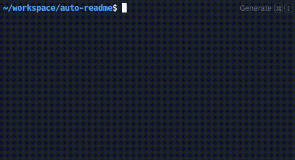

# Auto-Readme

**Generate polished GitHub READMEs using OpenAI – with a single command.**

Auto-Readme is a lightweight, developer-focused CLI tool that generates high-quality `README.md` files directly from your repository’s contents. It uses GPT-4 to analyze your codebase and craft structured, professional documentation — in seconds.

Built as a minimal alternative to more complex AI devtools like [LangChain](https://github.com/langchain-ai/langchain), [AutoGPT](https://github.com/Torantulino/Auto-GPT), or [OpenDevin](https://github.com/OpenDevin/OpenDevin), this tool focuses on one thing and does it well: **clean, accurate README generation for real-world repositories**.

---

## 🚀 Features

- ✅ Automatic README generation from repository contents
- 📄 Supports both text and binary file detection
- 💬 Uses OpenAI GPT-4 for intelligent summaries
- 🧪 Fully tested using `unittest` and `unittest.mock`
- 🧰 Simple CLI interface (ideal for GitHub Actions or automation)
- 🔐 Uses `.env` for secure API key handling
- 🪶 Minimal, developer-friendly, and MIT-licensed

---

## 🧠 How It Works

1. Scrapes a GitHub repo using [PyGithub](https://github.com/PyGithub/PyGithub)
2. Filters out binary files, retaining only readable code and text
3. Summarizes file content using GPT-4
4. Generates a custom README using a templated response prompt
5. Writes the contents of the readme directly to `README_output.md`

---

## 🛠️ Installation

1. Clone the repo:
  ```bash
   git clone https://github.com/leopoldsprenger/auto-readme.git
  ```
2. Install dependencies:
  ```bash
   pip install -r requirements.txt
  ```
3. Add your OpenAI API key and GitHub PAT to a `.env` file:
  ```bash
   OPENAI_API_KEY=your-key-here
   GITHUB_TOKEN=your-github-token-here
  ```
---

## 📦 Usage

You can integrate auto-readme in your own tooling or run it standalone.

Basic CLI usage:
  ```bash
   python cli/main.py "user/repo-name" --prompt "Optional prompt or summary focus"
  ```
Example:
  ```bash
   python cli/main.py "leopold/auto-readme" --prompt "Summarize with focus on CLI structure"
  ```
---

## 🎥 Demo



---

## 🔍 Example Output

Your generated README will include:
- Project title and description
- Key features
- Installation & usage instructions
- Credits and license

It adapts to different repo structures and user prompts.

---

## 🤝 Related Tools

If you're looking for broader automation or dev agents, check out:
- [LangChain](https://github.com/langchain-ai/langchain) – Composable agents and chains for LLM applications
- [AutoGPT](https://github.com/Torantulino/Auto-GPT) – Autonomous GPT-4 agent for task planning
- [OpenDevin](https://github.com/OpenDevin/OpenDevin) – Open-source AI developer assistant

Auto-Readme keeps things simple and transparent — perfect for developers who want readable output without overhead.

---

## 📄 License

This project is licensed under the MIT License – see the `LICENSE` file for details.
